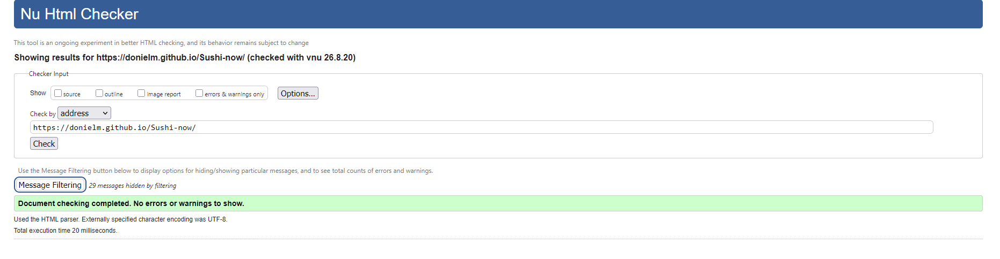
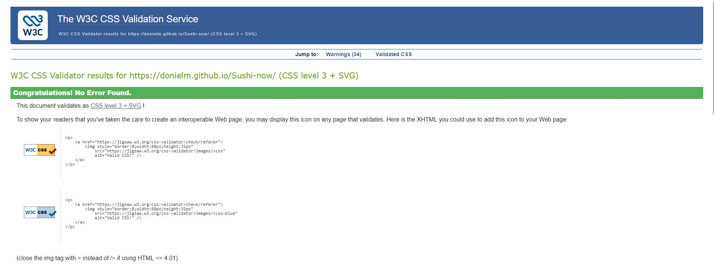

# Shushi-Now-Website

A Website based on a sushi delivery service delivering the best shushi to you

## Live Site

View Shushi Now https://donielm.github.io/Sushi-now/

### User Stories

- As a user, I want to understand the purpose of the website quickly.
- As a user, I want to navigate easily between sections.
- As a user, I want to learn about sushi delivery.
- As a user, I want to view the website easily on desktop, tablet and mobile.

### Strategy and Scope

The aim is to introduce a sushi delivery service delivering the best shushi to you.

This version is a one-page front-end website. More advanced tools are planned as future features.

### Structure

The website uses a simple one-page structure with navigation, hero, about us, menu, newsletter and footer.

### Typography

plus-jakarta-sans from Google Fonts is used throughout the website for a clean and modern look, with an alternate of san-serif.

## Testing

The website was manually tested to make sure the main features work correctly.
Checks included:

- navigation links
- images loading correctly
- keyboard navigation
- heading structure
- alt text
- desktop, tablet and mobile layouts

### Colour Scheme

--color-creamson: #fff0de;
--color-white: #fff;
--black-200: #020202;
--black-300: #333333;
--black-400: #1f1e31;
--black-500: #555555;
--gray-100: #888888;
--color-red: #b1454a;

The lighter neutral colours Palette creates a modern look and contrasts with the striking red and black

## AI Use

AI was used to support project planning, code suggestions, explanations, troubleshooting and content development.

AI suggestions were reviewed, adapted and tested before being used in the final project.

### Validation

#### HTML

The HTML was tested using the W3C Markup Validator and returned no errors or warnings.

#### CSS

The CSS was tested using the W3C CSS Validator and returned no errors.

## Deployment

The website was deployed using GitHub Pages.
Steps:

1. Open the GitHub repository.
2. Go to Settings > Pages.
3. Select Deploy from a branch.
4. Select `master` and `/root`.
5. Save and open the generated live link.

## Testing

The website was manually tested to make sure the main features work correctly.
Checks included:

- navigation links
- images loading correctly
- keyboard navigation
- heading structure
- alt text
- desktop, tablet and mobile layouts
